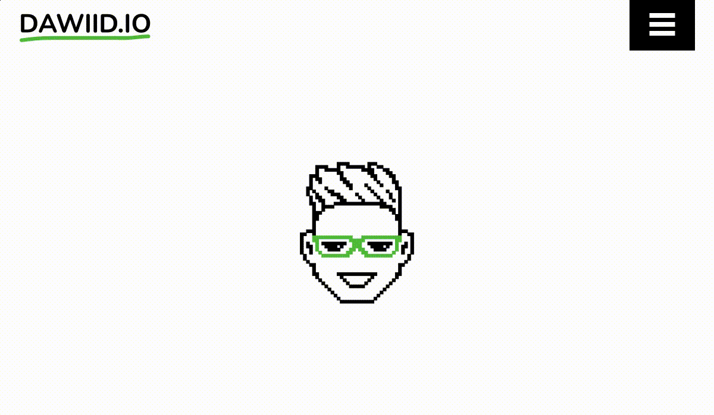
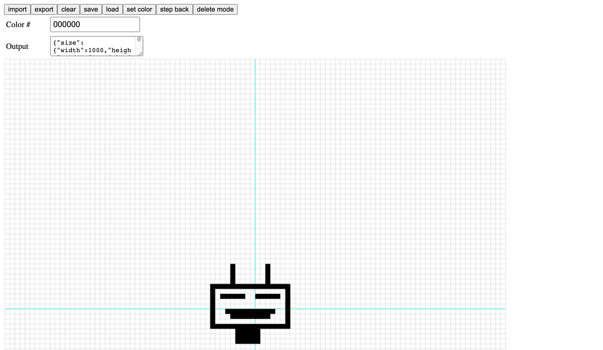

# fopix



Fopix is a simple tool for creating 2D pixel text, and simple graphics animations. 
It is based on ThreeJS and custom forces engine, here is the [DEMO](https://dawiid.io)

## Usage 

```ts
import { createFopix, SectionData } from '~/index';

// just a basic section with a bunch of words and tags
const SECTIONS: SectionData[] = [
    {
        type: 'words',
        text: [
            'Hi',
            `I'm David`,
            `and I'm a`,
            `software engineer`
        ]
    },
    {
        type: 'tags',
        text: [
            'test',
            'lorem',
            'ipsum',
            'dolor'
        ]
    }
];

function main() {
    const container = document.getElementById('myElement');

    const fopix = createFopix({
        container,
        sections: SECTIONS,
    });

    container.addEventListener('click', () => {
        // navigate through animation, go to next word or section
        fopix.next();
    });
}
```

## API

function `createFopix` takes object with the below options as it's first argument:

| name            | type          | default value | required  | description                                                                    |
|-----------------|---------------|---------------|-----------|--------------------------------------------------------------------------------|
| container       | HTMLElement   |               | ✅         | html elemetnt where canvas should be rendered                                  |
| sections        | SectionData[] |               | ✅         | sections array, more about sections and their types below                      |
| backgroundColor | number        | 0xffffffff    | ❌         | canvas background color                                                        |
| size            | number        | 12            | ❌         | particle size in pixels (one square)                                           |
| letterSpacing   | number        | 5             | ❌         | letter spacing in pixels                                                       |
| color           | number        | 0x000000      | ❌         | text color (if particle includes it's own color will be ignored)               |
| debug           | boolean       | false         | ❌         | draws debug lines, helpful while developing                                    |
| width           | number        | undefined     | ❌         | fixed width, if not provided fop will try to obtain it from container element  |
| height          | number        | undefined     | ❌         | fixed height, if not provided fop will try to obtain it from container element |
| resizeFn        | ResizeFn      | () => ...     | ❌         | resize function, see resize example                                            |

## Sections

There are three types of section

```ts
type VisualizationStateManagerSectionType = 'words' | 'tags' | 'sign';
```

the main difference between them is transition

- `words` will just transition to another word 
- `tags` between words will be floating cloud of points
- `sign` is just special type of `words`

## Editor



After running `npm run dev` simple editor will be available, you can later use exported graphics as input to section 
with type `sign`.